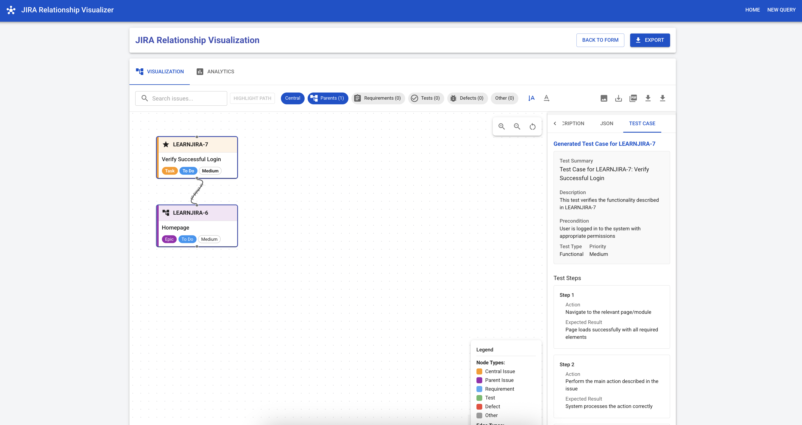

# JIRA Relationship Visualizer

A full-stack application that visualizes relationships between JIRA issues using Python (FastAPI) and React.



## Features

- Connect to JIRA using your credentials
- Visualize relationships between JIRA issues
- See requirements, test cases, and defects in an interactive graph
- Interactive tabbed UI with visualization and analytics views
- Advanced search and path highlighting to find connections between issues
- Filter visualization by issue types
- Multiple export options (PNG, JPEG, PDF, CSV)
- Comprehensive analytics with charts and statistics
- Zoom, pan, and explore the relationship graph
- Toggle between vertical and horizontal layout
- View full JIRA issue descriptions
- Format JIRA data for LLM (Large Language Model) processing
- Export issue data as JSON for advanced analysis

### AI-Powered Features

- **Generate test cases in XRay format** using AI (Ollama LLM with deepseek-r1:8b model)
- **Copy generated test cases** directly to clipboard for use in JIRA/XRay
- **Intelligent description parsing** that identifies acceptance criteria, requirements, and more
- **Enhanced ADF to text conversion** with support for tables, code blocks, and formatting
- **Structured data extraction** for more accurate test case generation
- **View test case status** for issues with existing test cases

## Prerequisites

- Python 3.8+ with pip
- Node.js 16+ with npm
- JIRA account with API token
- Docker and Docker Compose (for containerized deployment)

### System Requirements

For basic functionality:
- 4GB RAM
- 2 CPU cores
- 1GB free disk space

For optimal LLM performance (test case generation):
- 8GB+ RAM recommended
- 4 CPU cores recommended
- 10GB+ free disk space for model storage

### Performance Considerations

When using the LLM features for test case generation:

- The first run will download the deepseek-r1:8b model (~8GB)
- Test case generation typically takes 5-15 seconds per request
- Memory usage increases when actively using the LLM
- For systems with limited resources, use the local Ollama approach

## Setup

### Backend Setup

1. Activate the Python virtual environment:

```bash
source jiraenv/bin/activate
```

2. Install dependencies (if not already installed):

```bash
cd backend
pip install -r requirements.txt
```

3. Create a `.env` file in the `backend` directory with your JIRA settings (optional):

```bash
cp .env.example .env
```

Edit the `.env` file with your JIRA credentials.

### Frontend Setup

1. Install dependencies:

```bash
cd frontend
npm install
```

## Running the Application

You can run the application in multiple ways:

### Using Docker with Local Ollama (Recommended)

This approach uses your locally installed Ollama instead of running Ollama in a Docker container, saving resources:

1. Install Ollama on your local machine:
   ```bash
   # On macOS/Linux
   curl -fsSL https://ollama.com/install.sh | sh
   ```

2. Start the application with local Ollama:
   ```bash
   ./start_with_local_ollama.sh
   ```

   This script will:
   - Check if Ollama is installed locally
   - Start Ollama if it's not already running
   - Check and pull the required model if needed
   - Start the application with Docker Compose

### Using Docker with Containerized Ollama

If you prefer to run everything in containers:

```bash
./start_with_ollama.sh
```

Or manually:

```bash
docker-compose up
```

This will start both the backend and frontend services, along with the Ollama LLM service for test case generation. The application will be available at http://localhost:3000.

#### Note on LLM Features

When using the application in Docker:
- The first run may take some time as the Ollama LLM model (deepseek-r1:8b) is downloaded
- Test case generation will automatically use the containerized Ollama service

To check if the Ollama service is running properly:
```bash
curl http://localhost:11434/api/tags
```

This should return a JSON list that includes the "deepseek-r1:8b" model.

### Using the start script

You can also start both the frontend and backend with the provided start script:

```bash
./start.sh
```

### Running separately:

### Backend

```bash
cd backend
source ../jiraenv/bin/activate
uvicorn app.main:app --host 0.0.0.0 --port 8000 --reload
```

### Frontend

```bash
cd frontend
npm run dev
```

## Usage

1. Navigate to http://localhost:3000 in your browser
2. Enter your JIRA credentials and the central JIRA issue ID
3. Click "Visualize" to generate the relationship graph
4. Explore the visualization by zooming and panning
5. Export the visualization as a PNG if needed
6. View issue descriptions and prepare data for LLM analysis

For more information on using the JIRA data with LLMs, see [JIRA LLM Integration](docs/jira_llm_integration.md).

### Using Test Case Generation with AI

The application now supports generating comprehensive test cases in XRay format using AI through the Ollama LLM service:

1. **Right-click on any JIRA issue node** in the visualization graph
2. Select **"Create Test Case in XRay Format"** from the context menu
3. The system will use the Ollama LLM (deepseek-r1:8b model) to analyze your issue and generate a test case
4. The generated test case will appear in a new tab next to the issue details
5. Review the generated test case which includes:
   - Test summary and description
   - Preconditions
   - Test type and priority
   - Detailed test steps with expected results
6. Use the **"Copy to Clipboard"** button to copy the test case for use in JIRA/XRay
7. (Coming soon) Use the **"Save to XRay"** button to directly save the test case to your JIRA instance

#### How It Works

The test case generation process includes:

1. **Intelligent parsing** of JIRA issue descriptions
2. **Structured data extraction** that identifies:
   - Acceptance criteria
   - Requirements
   - Steps to reproduce (for bug reports)
   - Expected and actual behavior
3. **Advanced prompt engineering** that guides the LLM to create thorough test cases
4. **Enhanced ADF to text conversion** for better handling of rich JIRA content

#### Requirements for Test Case Generation

- Ollama service must be running (automatically managed in Docker setup)
- The deepseek-r1:8b model should be available in Ollama
- Issues should have good descriptions for better test case generation
- For optimal results, include structured sections in your JIRA descriptions (e.g., "Acceptance Criteria:")

#### Viewing Test Case Status

You can also view the status of test cases associated with an issue:

1. **Right-click on any JIRA issue node** in the visualization graph
2. Select **"Show Test Case Status"** from the context menu
3. A modal will appear showing all test cases linked to the issue along with their status

### Advanced AI Features

The test case generation feature is part of our expanding AI capabilities:

- **LLM-Ready Data Export**: Format and export JIRA data for use with external LLMs
- **AI-Generated Test Cases**: Create comprehensive test cases with proper XRay structure 
- **Intelligent Structure Extraction**: Automatically identify key sections in JIRA descriptions
- **Enhanced ADF Parsing**: Convert Atlassian Document Format to properly formatted text
- **One-click Copy**: Copy generated test cases to clipboard for easy transfer to JIRA/XRay
- **Test Coverage Analysis**: Analyze test coverage across your requirements
- **Coming Soon**: Direct integration with XRay API for saving test cases

## Utility Scripts

The project includes several utility scripts to help with setup and troubleshooting:

### Ollama Setup and Diagnostics

The application provides several utility scripts to help with setup and troubleshooting:

#### Setup Scripts

- `start_with_local_ollama.sh`: Starts the application using your locally installed Ollama
  ```bash
  # Start with local Ollama (recommended approach)
  ./start_with_local_ollama.sh
  ```

- `setup_ollama_model.sh`: Checks for Ollama installation, starts the service, and downloads required models
  ```bash
  # Setup Ollama and download required models
  ./setup_ollama_model.sh
  ```

#### Diagnostic Tools

- `ollama_diagnostics.sh`: Comprehensive diagnostics on your Ollama setup
  ```bash
  # Run diagnostics if you're having issues with Ollama
  ./ollama_diagnostics.sh
  ```
  
  This script checks:
  - If Ollama is installed
  - If the Ollama service is running
  - If the required models are available
  - System resources (memory, disk space) for running LLMs
  - Network connectivity to the Ollama API

- `check_docker_setup.sh`: Verifies your Docker environment configuration
  ```bash
  # Check your Docker setup
  ./check_docker_setup.sh
  ```

### When to Use Local vs. Containerized Ollama

- **Local Ollama** (Recommended): Better performance, less resource usage, persistent model storage
- **Containerized Ollama**: Completely isolated environment, consistent setup across all systems

The local Ollama approach is recommended for most users as it:
1. Uses fewer system resources
2. Provides better performance for test case generation
3. Allows for model reuse across multiple projects
4. Avoids downloading the model again for each container restart

## Troubleshooting

### Common Issues

#### Test Case Generation Issues

- **Issue**: Test case generation fails with "Failed to generate test case"  
  **Solution**: Ensure the Ollama service is running and the deepseek-r1:8b model is available. Run `./ollama_diagnostics.sh` to check.

- **Issue**: Generated test cases are too generic  
  **Solution**: Improve your JIRA issue descriptions with detailed acceptance criteria and requirements sections.

#### Connection Issues

- **Issue**: Cannot connect to JIRA  
  **Solution**: Verify your JIRA credentials and ensure your API token has appropriate permissions.

- **Issue**: Docker container networking issues  
  **Solution**: Run `./check_docker_setup.sh` to diagnose and fix common Docker network problems.

### Getting Help

If you encounter any issues not covered here, please:

1. Check the [documentation](docs/)
2. Run the appropriate diagnostic script (`ollama_diagnostics.sh` or `check_docker_setup.sh`)
3. Open an issue on GitHub with details about the problem

## Security Note

This application stores JIRA credentials temporarily for the session. Your API token is sensitive information - never share it and use environment variables when possible.

## License

MIT
